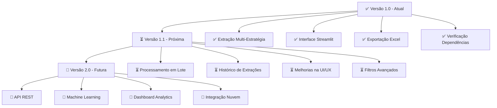

<div align="center">

# 📄 Extrator de Itens de NF-e

### 🇧🇷 PDF para Excel com IA e OCR

<p>
  <a href="#-sobre-o-projeto">Sobre</a> •
  <a href="#-funcionalidades">Funcionalidades</a> •
  <a href="#-tecnologias">Tecnologias</a> •
  <a href="#️-como-executar">Como Executar</a> •
  <a href="#-contato">Contato</a>
</p>


</div>

---

## 📱 Demonstração da Aplicação

<p align="center">

</p>

<h4 align="center">
  Aplicação Finalizada ✅
</h4>

---

## 🚀 Sobre o Projeto

Este projeto é um **Extrator Inteligente de Tabelas de NF-e** desenvolvido em Python com Streamlit, destinado a automatizar a extração de dados de produtos de Notas Fiscais Eletrônicas em formato PDF e exportar diretamente para planilhas Excel.

### 🎯 Objetivo Principal
Servir como **ferramenta de automação contábil** e peça de **portfólio profissional**, demonstrando proficiência em:

- **🤖 Processamento Inteligente de Documentos**: Múltiplas estratégias de extração (Tabula, Camelot, OCR)
- **📊 Manipulação de Dados**: Limpeza, estruturação e exportação com Pandas
- **💻 Desenvolvimento Web Moderno**: Interface responsiva com Streamlit
- **🔧 Integração de Tecnologias**: Combinação de bibliotecas especializadas para máxima compatibilidade

---

## ✨ Funcionalidades

- [x] **📤 Upload Intuitivo de PDFs**
  - Interface drag-and-drop
  - Suporte a múltiplos formatos de NF-e
  - Validação automática de arquivos

- [x] **🧠 Extração Inteligente Multi-Estratégia**
  - **Tabula-py**: Extração primária (lattice + stream)
  - **Camelot**: Alternativa para PDFs estruturados
  - **OCR Tesseract**: Fallback para PDFs escaneados

- [x] **📋 Visualização em Tempo Real**
  - Preview das tabelas extraídas
  - Identificação automática de produtos
  - Filtragem por número de colunas (≥5)

- [x] **📊 Exportação Profissional para Excel**
  - Formato .xlsx otimizado
  - Cabeçalhos estruturados
  - Download instantâneo

- [x] **🔍 Verificação de Dependências**
  - Status em tempo real na sidebar
  - Diagnóstico completo do ambiente
  - Instruções de correção integradas

### 📋 Resumo das Estratégias de Extração

| Método | Base de Processamento | Casos de Uso | Status |
|:---:|:---:|:---:|:---:|
| **🔲 Tabula-py** | Java + Ghostscript | PDFs estruturados com tabelas | ✅ Implementado |
| **📊 Camelot** | Ghostscript + OpenCV | PDFs com bordas bem definidas | ✅ Implementado |
| **👁️ OCR Tesseract** | Reconhecimento Óptico | PDFs escaneados/baixa qualidade | ✅ Implementado |

---

## 🛠️ Tecnologias Utilizadas

<table>
  <tr>
    <td><strong>Categoria</strong></td>
    <td><strong>Tecnologia</strong></td>
    <td><strong>Badge</strong></td>
    <td><strong>Descrição</strong></td>
  </tr>
  <tr>
    <td rowspan="2">Core</td>
    <td>Python</td>
    <td></td>
    <td>Linguagem principal de desenvolvimento</td>
  </tr>
  <tr>
    <td>Streamlit</td>
    <td></td>
    <td>Framework para interface web responsiva</td>
  </tr>
  <tr>
    <td rowspan="2">Extração</td>
    <td>Tabula-py</td>
    <td></td>
    <td>Extração primária de tabelas PDF</td>
  </tr>
  <tr>
    <td>Camelot</td>
    <td></td>
    <td>Extração alternativa avançada</td>
  </tr>
  <tr>
    <td rowspan="2">OCR</td>
    <td>PyMuPDF</td>
    <td></td>
    <td>Conversão PDF para imagem</td>
  </tr>
  <tr>
    <td>Tesseract</td>
    <td></td>
    <td>Reconhecimento óptico de caracteres</td>
  </tr>
  <tr>
    <td rowspan="2">Dados</td>
    <td>Pandas</td>
    <td></td>
    <td>Manipulação e estruturação de dados</td>
  </tr>
  <tr>
    <td>XlsxWriter</td>
    <td></td>
    <td>Geração de arquivos Excel otimizados</td>
  </tr>
</table>

---

## ⚙️ Como Executar o Projeto Localmente

### 📋 Pré-requisitos

Certifique-se de ter as seguintes dependências instaladas:

- **Python 3.7+**
- **Java JDK/JRE** (para Tabula-py)
- **Ghostscript** (para Camelot e Tabula-py)
- **Tesseract OCR** (opcional, para funcionalidade OCR)

### 🔧 Passo a Passo

#### 1. 📥 Clonar o Repositório

```bash
# Clone este repositório
git clone https://github.com/seu-usuario/extrator-nf-streamlit.git

# Acesse a pasta do projeto
cd extrator-nf-streamlit
```

#### 2. 🌐 Configurar o Ambiente Virtual

```bash
# Crie o ambiente virtual
python -m venv venv

# Ative o ambiente virtual
# Linux/macOS:
source venv/bin/activate

# Windows:
.\venv\Scripts\activate
```

#### 3. 📦 Instalar as Dependências Python

```bash
# Instale as dependências
pip install streamlit pandas tabula-py xlsxwriter camelot-py[cv] PyMuPDF pytesseract pillow
```

#### 4. 🔧 Instalar Dependências do Sistema

##### Java (Obrigatório)
- **Windows**: [Adoptium OpenJDK](https://adoptium.net/)
- **Linux**: `sudo apt-get install default-jdk`
- **macOS**: `brew install openjdk`

##### Ghostscript (Obrigatório) 
- **Windows**: [ghostscript.com](https://www.ghostscript.com/download/gsdnld.html) ⚠️ Marque "Add to PATH"
- **Linux**: `sudo apt-get install ghostscript`
- **macOS**: `brew install ghostscript`

##### Tesseract OCR (Opcional)
- **Windows**: [UB-Mannheim Tesseract](https://github.com/UB-Mannheim/tesseract/wiki)
- **Linux**: `sudo apt-get install tesseract-ocr tesseract-ocr-por`
- **macOS**: `brew install tesseract`

#### 5. 🚀 Executar a Aplicação

```bash
# Execute o aplicativo principal
streamlit run app.py

# Ou use o script auxiliar
python run_app.py
```

O aplicativo será aberto automaticamente no seu navegador em: **http://localhost:8501**

### ✅ Verificação de Instalação

Teste se as dependências estão configuradas corretamente:

```bash
# Verificar Java (deve estar no PATH)
java -version

# Verificar Ghostscript (deve estar no PATH)
gs --version

# Verificar Tesseract (opcional)
tesseract --version
```

---

## 📂 Estrutura do Projeto

```
extrator-nf-streamlit/
├── 📱 app.py                    # Aplicação principal Streamlit
├── 🎮 run_app.py               # Script de execução com configurações
├── 📋 requirements.txt         # Dependências Python
├── 📖 README.md               # Documentação do projeto
├── 📁 assets/                 # Recursos visuais
│   └── 🎬 demo-nf-extractor.gif
└── 📁 docs/                   # Documentação adicional
    └── 📄 TROUBLESHOOTING.md
```

---

## 🎯 Casos de Uso

- **📊 Contabilidade**: Automatização da entrada de dados fiscais
- **🛒 Procurement**: Análise rápida de fornecedores e produtos  
- **🔍 Auditoria**: Verificação e compilação de documentos fiscais
- **📈 Gestão**: Consolidação de dados para relatórios gerenciais
- **⚡ Automação**: Redução de trabalho manual repetitivo

---

## ⚠️ Isenção de Responsabilidade

<div align="center">

> ### 🔒 **Importante**: Disclaimer Técnico
> 
> Este projeto foi desenvolvido para **fins de automação e portfólio**.  
> A precisão da extração depende da **qualidade e estrutura do PDF original**.
> 
> **Limitações Técnicas:**
> - ⚠️ Dependente da estrutura original do PDF
> - ⚠️ PDFs escaneados podem ter menor precisão
> - ⚠️ Variações entre emissores de NF-e podem afetar resultados
> - ⚠️ Requer configuração correta das dependências do sistema
> 
> 🔍 **Sempre revise** os dados extraídos antes do uso em produção.

</div>

---

## 🗺️ Roadmap do Projeto



---

## 🔧 Solução de Problemas

### Problemas Comuns

| Erro | Causa | Solução |
|:---|:---|:---|
| ❌ "Java not found" | Java não instalado/PATH | Instalar Java + configurar PATH |
| ❌ "Ghostscript not found" | Ghostscript não instalado/PATH | Instalar Ghostscript + marcar "Add to PATH" |
| ❌ "Tesseract not found" | Tesseract não no caminho esperado | Instalar no caminho padrão |
| ❌ Extração vazia | PDF sem tabelas estruturadas | Verificar qualidade do PDF |
| ❌ Erro de dependências Python | Bibliotecas não instaladas | `pip install -r requirements.txt` |

### 🆘 Precisa de Ajuda?

1. Verifique a **sidebar** da aplicação para status das dependências
2. Execute os **comandos de verificação** mencionados acima
3. Consulte a documentação em `docs/TROUBLESHOOTING.md`
4. Abra uma **issue** no repositório com detalhes do erro

---

## 🤝 Contribuindo

Contribuições são sempre bem-vindas! Se você tem sugestões para melhorar este projeto:

1. 🍴 Faça um **Fork** do projeto
2. 🌿 Crie uma **Branch** para sua feature (`git checkout -b feature/AmazingFeature`)
3. 💾 **Commit** suas mudanças (`git commit -m 'Add some AmazingFeature'`)
4. 📤 **Push** para a Branch (`git push origin feature/AmazingFeature`)
5. 🔄 Abra um **Pull Request**

### 💡 Ideias de Contribuição

- 📊 Melhorias na interface do usuário
- 🤖 Novos algoritmos de extração  
- 🔧 Otimizações de performance
- 📚 Melhorias na documentação
- 🧪 Testes automatizados

---

## 📞 Contato

<div align="center">

### 🤝 Vamos nos Conectar?

  <a href="https://www.linkedin.com/in/seu-perfil/" target="_blank">
    
  </a>
  
  <a href="https://github.com/seu-usuario" target="_blank">
    
  </a>
  
  <a href="https://www.instagram.com/seu-instagram/" target="_blank">
    
  </a>
  
  <a href="mailto:seu-email@example.com">
    
  </a>

**Seu Nome** - Desenvolvedor & Especialista em Automação

</div>

---

<div align="center">
  
  ### 🌟 Gostou do projeto?
  
  Se este projeto foi útil para você, considere deixar uma ⭐!
  
  <a href="https://github.com/seu-usuario/extrator-nf-streamlit">
    
  </a>
  
  <a href="https://github.com/seu-usuario/extrator-nf-streamlit/fork">
    
  </a>
  
  <a href="https://github.com/seu-usuario/extrator-nf-streamlit/issues">
    
  </a>
  
  ---
  
  <sub>Feito com ❤️ por <a href="https://github.com/seu-usuario">Seu Nome</a></sub>
  
  <sub>Este projeto representa a união entre automação inteligente e desenvolvimento moderno em Python, demonstrando como tecnologia pode otimizar processos contábeis e fiscais.</sub>
  
</div>
